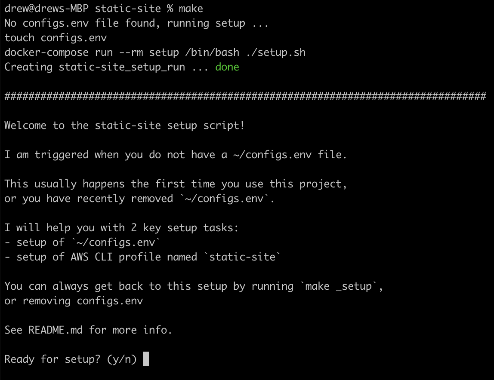
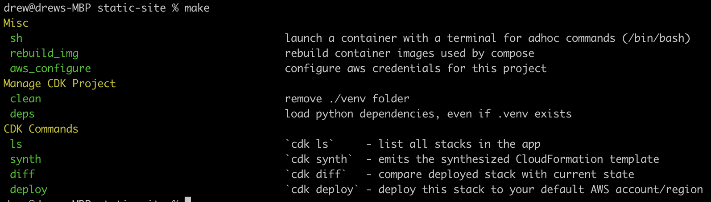
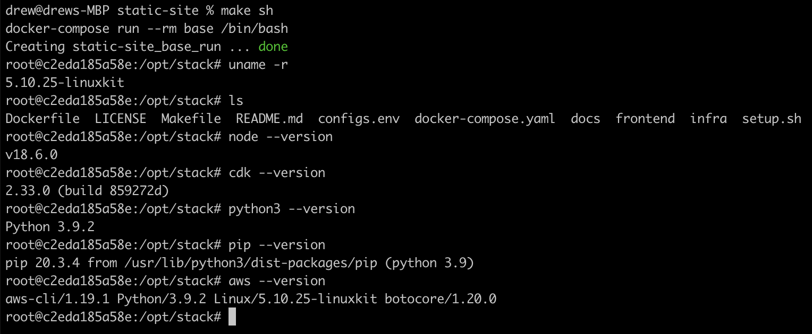

# Demo of a static site using AWS CDK with Python

This repo will deploy a static site (S3, CloudFront and Route53) using CDK written in Python. All workstation dependencies have been containerized.

CDK code originally came from [aws-samples/aws-cdk-examples/python/static-site/](https://github.com/aws-samples/aws-cdk-examples/tree/master/python/static-site) but has since been modified.

## Getting started

Run `make` to get started. A containerized setup script will run the first time to ensure you have the right config and AWS profile.

Once setup is complete, your `make` command will look like this:

### CDK Deployments

You should be ready to run any of the CDK commands, and start deploying infrastrcuture to AWS.

The typical flow at this point would be `make bootstrap` then `make deploy`.

The `make bootstrap` command deploys the CDK toolkit stack into an AWS environment (creates a CloudFormation stack: `CDKToolkit`).

The `make deploy` command deploys the stack to the AWS account/region (creates a CloudFormation stack: `static-site-stack`).

For more info on how this repo manages the infrastructure code see [infra/README.md](infra/README.md).

## Using the development container

If you need to run specific commands that aren't available as make targets, you can create a containerized shell with everything you need for CDK development and more. To create a new shell run `make sh`

Once the container starts up you'll have a `/bin/bash` shell where you can run any commands you'd expect in a linux terminal.

## What's under the hood?

For those that are curious about what's under the hood, here are some key files:

- [Dockerfile](Dockerfile) is a [node base container](https://hub.docker.com/_/node) with Python, AWS CLI, and AWS CDK added to it
- [docker-compose.yml](docker-compose.yml) manages the execution of all tasks, and will show details of default working directories, volumes etc
- [Makefile](Makefile) is your interface this repo, and will help run common tasks for you
- [setup.sh](setup.sh) will guide you through file/AWS config and have you setup in no time!

You can make you own modifications to the [Dockerfile](Dockerfile) then run `make rebuild_img` to rebuild the images and start using them.

You can make changes to other key files if you need to extran functionality, like adding a new make target.

# About this repo

This repo aims to:
- Manage an infra stack via AWS CDK
- Build a simple infra stack for a static site: Route53, CloudFront, S3
- Easy setup and mangement (3 musketeers) - make/compose/docker should be all the software you need
- The user is prompted for any other expectations (config etc) as they're needed, so setup will run automatically

Features:
- shell into base container
- can rebuild compose images when you change the dockerfile
- python deps via venv, and won't rebuilt if folder exists (to save time), can run `make deps` to override this
- make has targets, with groups, and colors
- 3 musketeers compliant, all driven by make which calls compose and docker, and making optimial use of conventions like `_target` and comments only for the targets users need to see
- setup script runs at very start of project, and whenever configs.env is empty 

todo:
- use configs.env as when infra, currently CDK uses hardcodes in cdk.json
- review/improve IAM permission requirements
- include frontend files deploying to s3 bucket (currently manual)

done:
- build out the actual infra code
- using python activate/venv (to ensure some caching between commands)
- be more clear about requirements (key env vars, AWS creds etc) ... now a setup script that runs when needed
- using a node image, so had to add python bits and CDK library in Dockerfile - ideally I'd like to use a well made image (tab complete doesn't work, up arrow for history doesn't work) ... was using /bin/sh but now defaulting to /bin/bash which seems to do what I expect it to in the terminal
